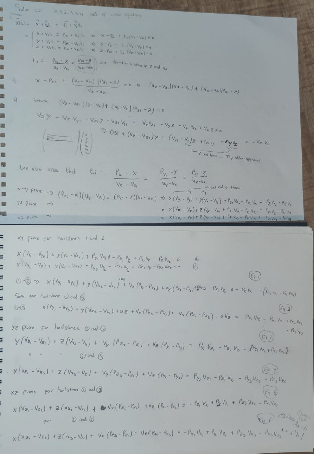

Setting up a system of equations -> hyperplane
hailstone position at time `t=initial_position+t×velocity`
We use Cramer's rule, where determinants are used to solve for the six unknowns:
`x`,`y`,`z`,`v_x`,`v_y`,`v_z`

The rock's position at time t_i
must equal the i^th
hailstone's position at that time. This gives us three linear equations for each hailstone:
`x + t_i * vx = px_i + t_i * vx_i --> x = px_i + t_i * (vx_i - vx)`

`y + t_i * vy = py_i + t_i * vy_i --> y = py_i + t_i * (vy_i - vy)`

`z + t_i * vz = pz_i + t_i * vz_i --> z = pz_i + t_i * (vz_i - vz)`

Substitute `t = x - x_i / (vx_i - vx)`.

The system is *overdetermined* -> we only need two equations. Eliminate z
`x + t_i * vx = px_i + t_i * vx_i --> x = px_i + t_i * (vx_i - vx)`

`y + t_i * vy = py_i + t_i * vy_i --> y = py_i + t_i * (vy_i - vy)`

This means we have to add 3 hailstones to solve this system of 3 unknown

